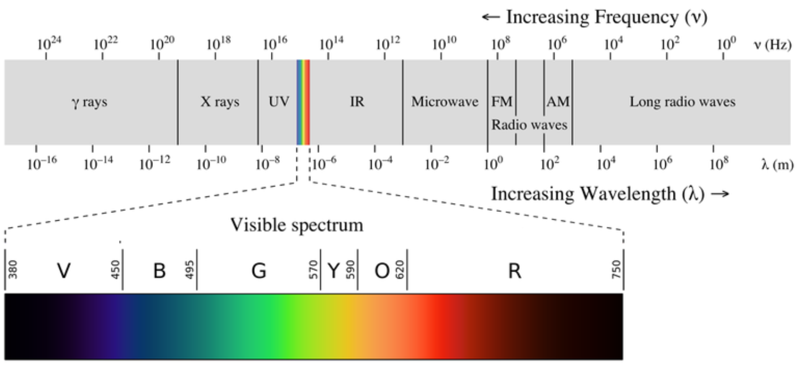
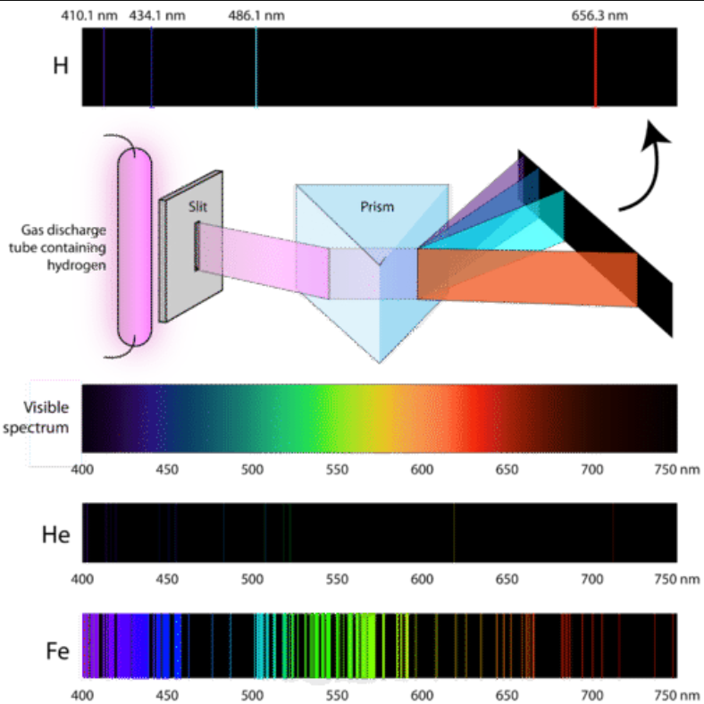

Every atom has a specific color signature. When an atom receives electromagnetic radiation, its electrons will change its [[atomic-orbital]], for example being exited and jumping from the ground state to the excited state. An electron can be exited in many different ways, the [[glow-discharge]] is an example.

Electrons at different orbitals are at different [[energy-level]]. The electrons have different and discrete energy ([[quantum-mechanics]]). During the change in orbital, it absorbs or emits energy. This energy is in the form of photons.

The [[exited-state]] is mostly unstable. The neutrons absorb energy (photons) and move to an orbital at a higher energy level, and then shortly move back and emit energy (photon).

The electromagnetic spectrum is an example of a continuous spectrum.
 The spectrum can be shown through a prism.
 When light from a hydrogen gas discharge tube is passed through a prism, the light is split into four visible lines.
