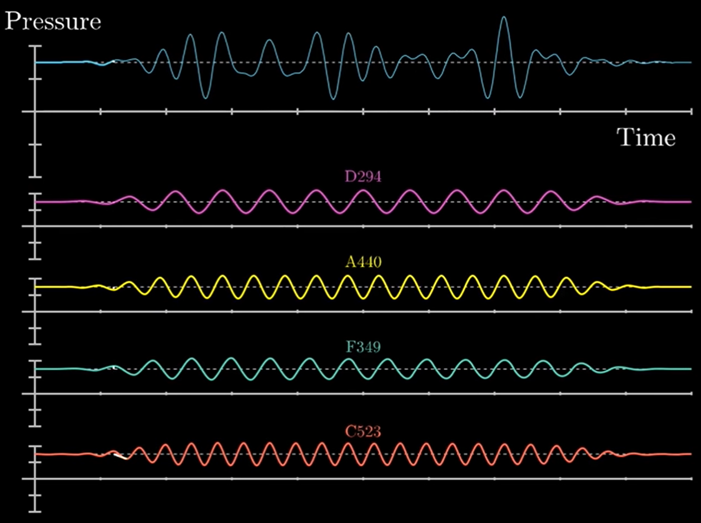
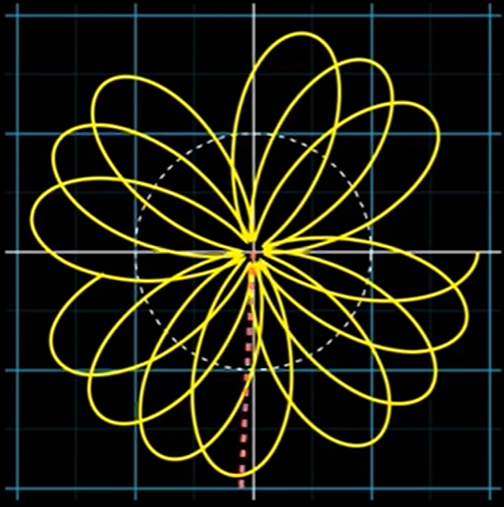

# Begin from a question

At first, consider that there is a signal of time and intensity. For
example the sound wave. The intensity now will be the pressure at our
eardrum.



Actually it is composed of different simple waves and can be described
by different simple waves. But the problem is, how to find these simple
waves out?

# Wrap it into a \"circle\" and rotate it

The solution is, at first wrap this signal into a circle. The next step
is rotate it at different frequency. E.g. at a small frequency, it looks
like this:



But we keep increasing the frequency until it has the same frequency
with the original signal, the pattern will looks like this:


So, they looks different, but how to express their difference? The
answer is the centroid mass of the \"circle\".

# Centroid of mass vs. frequency

Now, if we plot centroid of mass vs. frequency, it looks like this:


From the plot we can see several different peaks. This means actually
that the wave is added up by different simple waves.

In this way we can find out how many simple waves are added up to form
this original complex wave. And we can filter out the signals at
different frequency as we wish.

But what is the problem?! -- we need to find suitable tools to process
all of these steps.

# Mathematics

The [[euler-s-formula]]
transform the trigonometric functions into the complex plane, which is a
perfect tool to code the amplitude and the phase in the \"rotation\".

The rotation is well expressed by $e^{2\pi it}$. But if we want to apply
the rotation at different frequency, we need to add the frequency $f$ to
the formula, which transforms into $e^{2\pi ift}$. And a minus is added
to describe the clockwise rotation according to our habit:
$e^{-2\pi ift}$.

Now, we need to apply this rotation upon the original signal $g(t)$. So
it transforms into $g(t)e^{-2\pi ift}$.

But how to describe the centroid of mass? The answer is: Integration:

```{=latex}
\begin{equation}
\frac{1}{t_2-t_1}\int _{t_1}^{t_2} g(t) e^{-2\pi ift} dt
\end{equation}
```
But actually the Fourier transform does not need the time term
$\frac{1}{t_2-t_1}$. After deleting it, we can tell that how long does
one simple signal last. If one signal has a huge value of \"mass
centroid\" (although it is no longer a centroid of mass), it means this
simple signal lasts very long.

So that, Fourier transform:

```{=latex}
\begin{equation}
\^{g}(t) = \int _{t_1}^{t_2} g(t) e^{-2\pi ift} dt
\end{equation}
```
